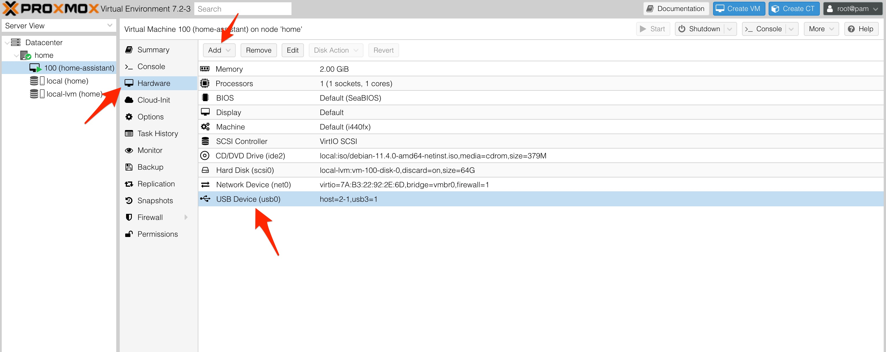

# HowTo

## Auto Mount USB Drive on Startup

In order to mount your USB drive permanently after reboot add a line into your /etc/fstab config file. If drives are added or removed from the Proxmox the device may change.  For this reason the partion UUID will need to be used instead of the block device name.
```bash
ls -l /dev/disk/by-uuid/*
lrwxrwxrwx 1 root root 13 Jun 30 10:50 /dev/disk/by-uuid/169C06729C064CA5 -> ../../zd128p1
lrwxrwxrwx 1 root root 10 Sep  7 08:23 /dev/disk/by-uuid/1C9696109695EA92 -> ../../sde1
lrwxrwxrwx 1 root root 10 Jun 30 10:50 /dev/disk/by-uuid/4331501758443482231 -> ../../sdd2
lrwxrwxrwx 1 root root 12 Jun 30 10:50 /dev/disk/by-uuid/46FF7800EE8FFB6D -> ../../zd96p1
```
Above will give you the uuid.  Open the fstab for editing
```bash
nano /etc/fstab
```
Add this line to your fstab using the correct UUID.
```bash
/dev/disk/by-uuid/1C9696109695EA92    /mnt/usb-drive         ext4   defaults   0
```
Mount drive
```bash
mount -a
```

## Proxmox USB Passthrough



## Add External USB Storage to Proxmox

Follow steps from [Add External USB Storage to Proxmox](https://thehomelab.wiki/books/promox-ve/page/add-external-usb-storage-to-proxmox)

## Install Windows 10 on Proxmox 7.1

Follow steps from [HowTo install & configure Windows 10 in a VM on Proxmox VE 7.1 - step-by-step](https://blog.habitats.tech/howto-install-and-configure-windows-10-in-a-vm-on-proxmox-ve-71-step-by-step)

## Share PVE Directory With LXC

/mnt/ext1/share - Folder to share
/share - Folder name in LXC

```bash
pct set 102 -mp0 /mnt/ext1/share,mp=/share
```

## Create NFS Server on LXC

```bash
vi /etc/exports
```
/share 192.168.0.0/24(rw,sync,no_subtree_check)

```bash
exportfs -a
systemctl restart nfs-kernel-server
sudo ufw allow from 192.168.0.0/24 to any port nfs
ufw enable
```

On client side, make sure nfs common is installed:
```bash
sudo apt install nfs-common
sudo mount 192.168.0.32:/share /mnt/share
```

See [Install NFS Server and Client on Ubuntu
](https://vitux.com/install-nfs-server-and-client-on-ubuntu/)
